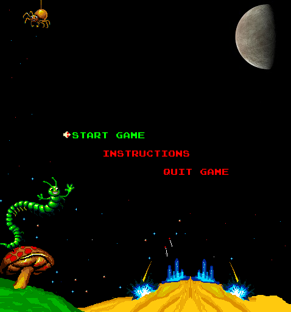
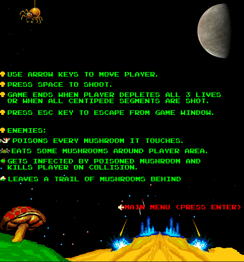
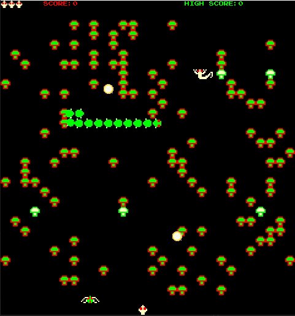

# Centipede Clone
This is a `Centipede` arcade game clone coded using modern C++ and `SFML 2.5.1` graphics library. No OpenGL and/or frameworks built ontop of SFML were used (very vanilla :smiley:).

## Main Menu
Player can navigate main menu using up and down arrows. Press Enter to make a selection.

## Game instructions

## In Game Play

If player shoots a bomb, it will begin to detonate and destroy everything within radius.

Player can reset High Score at the end of game.

# How to Run Game
Click on release link `(on the right)` and download `executables.zip` folder under the latest release. Unzip the file and run the `Centipede.exe` file.

Alternatively, you can download the `Source code` zip folder under releases. This method will require an IDE setup.